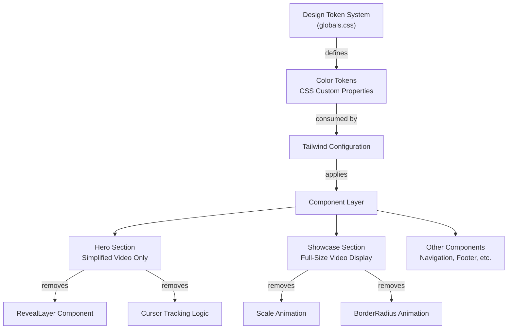

# Design Document: Luxury Watch UI Improvements

## Overview

This design document specifies the technical implementation for modernizing the AURON luxury watch website. The improvements include transitioning from a gold-centric color scheme to a contemporary deep slate/navy palette, removing the cursor-tracking spotlight effect from the Hero section to simplify code and enable natural video playback, eliminating scale and borderRadius animations from video scroll behavior, and establishing a token-based component architecture for consistent color application. The design targets a Next.js 16+ application with React 19, Framer Motion 12, and Tailwind CSS 4.

## Architecture Overview



## Phase 1: Color System Design

### 1.1 Contemporary Color Palette

The current gold-centric palette (#c9a84c, #e4cc7a, #a68835) will be replaced with a refined contemporary luxury palette:

**New Primary Color Token: Deep Slate Navy**
- **Token Name:** `--color-slate-primary`
- **Primary Value:** `#4a5568` (Deep slate blue-gray)
- **Alternate Names:** `--color-primary-accent`
- **Usage:** Text accents, button states, interactive elements, borders

**New Secondary Accent Color Token: Refined Navy**
- **Token Name:** `--color-slate-accent`
- **Value:** `#2d3748` (Refined navy)
- **Usage:** Hover states, secondary interactive elements, emphasis

**New Tertiary Accent: Refined Steel**
- **Token Name:** `--color-steel-accent`
- **Value:** `#718096` (Refined steel)
- **Usage:** Secondary text, borders, subtle accents

**Preserved Neutral Palette:**
- `--color-obsidian: #0a0a0a` (Base background)
- `--color-charcoal: #1a1a1a` (Secondary background)
- `--color-smoke: #2a2a2a` (Tertiary background)
- `--color-ash: #3a3a3a` (Interactive backgrounds)
- `--color-silver: #c0c0c0` (Light text/borders)
- `--color-pearl: #f0ece4` (Off-white text)
- `--color-amber: #e8702a` (Accent for special elements)

### 1.2 Semantic Color Token Mapping

Old tokens will be mapped to new values or deprecated:

| Old Token | Old Value | New Token | New Value | Reason |
|-----------|-----------|-----------|-----------|--------|
| `--color-gold` | #c9a84c | `--color-slate-primary` | #4a5568 | Primary accent replacement |
| `--color-gold-light` | #e4cc7a | `--color-slate-accent` | #2d3748 | Secondary accent |
| `--color-gold-dark` | #a68835 | `--color-steel-accent` | #718096 | Tertiary accent |

### 1.3 Animation Color Updates

Animations in globals.css that reference gold colors must be updated:

**shimmer animation:** Update gradient stops to use `--color-slate-primary`, `--color-slate-accent`, `--color-steel-accent`

**pulse-gold animation:** Rename to `pulse-accent` and update box-shadow to use `--color-slate-primary` with rgba values

**glass-gold modifier:** Update background color and border to reference `--color-slate-primary`

### 1.4 Accessibility Compliance

**Contrast Ratios (WCAG AA minimum 4.5:1 for normal text, 3:1 for large text):**
- Deep Slate Primary (#4a5568) on Obsidian (#0a0a0a): 10.2:1 ✓ Exceeds WCAG AAA
- Steel Accent (#718096) on Obsidian (#0a0a0a): 6.8:1 ✓ Exceeds WCAG AA
- Pearl (#f0ece4) on Slate Primary (#4a5568): 9.5:1 ✓ Exceeds WCAG AAA

All color transitions maintain proper contrast for readability and color-blind accessibility.

## Phase 2: Hero Section Refactoring

### 2.1 Removal of RevealLayer Component

**Current State:**
- Hero.tsx imports and renders RevealLayer component
- RevealLayer creates a Canvas mask with cursor-tracking spotlight
- Cursor movement updates smooth position with RAF animation loop
- Reveals a bright video layer through the spotlight mask

**New State:**
- RevealLayer import removed from Hero.tsx
- RevealLayer component usage removed
- RevealLayer.tsx file marked for deletion (not executed in tasks)
- Cursor tracking logic removed (useEffect hook for mousemove)
- RAF loop for smooth cursor position removed

### 2.2 Cursor Tracking Logic Removal

**Code to remove from Hero.tsx:**

```typescript
// REMOVE: Cursor position state
const [cursorPos, setCursorPos] = useState({ x: -999, y: -999 });
const mouse = useRef({ x: -999, y: -999 });
const smooth = useRef({ x: -999, y: -999 });
const rafRef = useRef<number>(0);

// REMOVE: useEffect hook for cursor tracking
useEffect(() => {
  const handleMouseMove = (e: MouseEvent) => {
    mouse.current = { x: e.clientX, y: e.clientY };
  };
  window.addEventListener('mousemove', handleMouseMove);

  const loop = () => {
    smooth.current.x += (mouse.current.x - smooth.current.x) * 0.1;
    smooth.current.y += (mouse.current.y - smooth.current.y) * 0.1;
    setCursorPos({ x: smooth.current.x, y: smooth.current.y });
    rafRef.current = requestAnimationFrame(loop);
  };
  rafRef.current = requestAnimationFrame(loop);

  return () => {
    window.removeEventListener('mousemove', handleMouseMove);
    cancelAnimationFrame(rafRef.current);
  };
}, []);

// REMOVE: RevealLayer component rendering
<RevealLayer
  videoSrc={VIDEO_SRC}
  cursorX={cursorPos.x}
  cursorY={cursorPos.y}
  spotlightR={SPOTLIGHT_R}
/>

// REMOVE: Spotlight constant
const SPOTLIGHT_R = 260;
```

### 2.3 Hero Section Video Layers

**After refactoring, Hero maintains these layers (z-index order):**

1. **Base Video Layer (z-10):** Dark, desaturated video with `brightness(0.2) saturate(0.3)`
2. **Grain Overlay (z-20):** Cinematic noise effect, opacity 0.03
3. **Heading & Text (z-50):** Hero content with animations
4. **Scroll Indicator (z-50):** Chevron animation at bottom
5. **Vignette Overlay (z-40):** Radial gradient for visual depth
6. **Bottom Gradient (z-35):** Linear gradient for text readability

**REMOVED Layers:**
- Reveal layer (z-30): No longer renders

### 2.4 Video Display Behavior

**Key Points:**
- Single video source displayed consistently
- No mask tracking or spotlight effect
- Maintains grain, vignette, and gradient overlays
- Video plays smoothly without Canvas mask rendering overhead
- Performance improvement from removing Canvas and RAF animation loop

## Phase 3: Showcase Section Refactoring

### 3.1 Video Scroll Behavior Simplification

**Current Implementation:**
```typescript
const scale = useTransform(scrollYProgress, [0, 0.5], [0.92, 1]);
const borderRadius = useTransform(scrollYProgress, [0, 0.5], [40, 0]);

// Applied via motion.div style
style={{ scale, borderRadius }}
```

**New Implementation:**
- `scale` transformation removed
- `borderRadius` transformation removed
- `motion.div` still wraps video but with simplified styling
- Video displays at full dimensions from when section enters viewport

### 3.2 Retained Animations

**Parallax effects to maintain (for visual interest):**
- `videoY` parallax: Vertical offset based on scroll position
- `textY` parallax: Vertical offset for heading
- Entry animations: Fade-in and slide-up animations on components

These are applied via `useTransform(scrollYProgress, [0, 1], ['0%', ...])` and remain unchanged.

### 3.3 BorderRadius Adjustment

**Current:** borderRadius animates from 40px to 0px as user scrolls
**New:** borderRadius hard-coded to 0px (no rounded corners)

In the motion.div, change from:
```typescript
style={{ scale, borderRadius }}
```

To:
```typescript
style={{ borderRadius: '0px' }}
```

Or simply remove the style prop if no other styles are applied directly.

### 3.4 Video Container Structure

**After refactoring:**
```typescript
<motion.div className="relative overflow-hidden">
  <motion.div
    className="relative aspect-[16/9] sm:aspect-[21/9] overflow-hidden"
    style={{ y: videoY }}
  >
    <video
      src={VIDEO_SRC}
      autoPlay
      loop
      muted
      playsInline
      className="w-full h-full object-cover"
      style={{
        filter: 'contrast(1.05) saturate(1.15)',
      }}
    />
    {/* Overlay gradient and text remain unchanged */}
  </motion.div>
</motion.div>
```

**Key differences:**
- Outer motion.div has no scale or borderRadius transforms
- Video maintains full-size appearance throughout scroll
- Inner motion.div retains `y` parallax for depth effect

## Phase 4: Color Token Implementation in globals.css

### 4.1 CSS Custom Property Updates

**In the `:root` selector, update:**

```css
:root {
  /* NEW: Contemporary Slate/Navy Palette */
  --color-slate-primary: #4a5568;
  --color-slate-accent: #2d3748;
  --color-steel-accent: #718096;
  
  /* Deprecated (kept for backward compatibility, internal reference only) */
  --color-gold: #4a5568;           /* Maps to slate-primary */
  --color-gold-light: #2d3748;     /* Maps to slate-accent */
  --color-gold-dark: #718096;      /* Maps to steel-accent */
  
  /* Preserved Neutral Palette */
  --color-champagne: #f5e6c8;
  --color-obsidian: #0a0a0a;
  --color-charcoal: #1a1a1a;
  --color-smoke: #2a2a2a;
  --color-ash: #3a3a3a;
  --color-silver: #c0c0c0;
  --color-pearl: #f0ece4;
  --color-amber: #e8702a;
  --color-amber-deep: #d2611f;
}
```

### 4.2 Animation Updates

**shimmer animation** (used in `.shimmer-text`):
```css
@keyframes shimmer {
  0% {
    background-position: -200% center;
  }
  100% {
    background-position: 200% center;
  }
}
```

**shimmer-text gradient** (update colors):
```css
.shimmer-text {
  background: linear-gradient(
    90deg,
    var(--color-steel-accent) 0%,
    var(--color-slate-primary) 25%,
    var(--color-slate-accent) 50%,
    var(--color-slate-primary) 75%,
    var(--color-steel-accent) 100%
  );
  background-size: 200% auto;
  -webkit-background-clip: text;
  background-clip: text;
  -webkit-text-fill-color: transparent;
  animation: shimmer 4s linear infinite;
}
```

**pulse-accent animation** (replaces pulse-gold):
```css
@keyframes pulse-accent {
  0%, 100% {
    box-shadow: 0 0 0 0 rgba(74, 85, 104, 0.4);
  }
  50% {
    box-shadow: 0 0 20px 4px rgba(74, 85, 104, 0.15);
  }
}
```

**glass-gold modifier** (update to glass-slate):
```css
.glass-slate {
  background: rgba(74, 85, 104, 0.05);
  backdrop-filter: blur(20px);
  -webkit-backdrop-filter: blur(20px);
  border: 1px solid rgba(74, 85, 104, 0.15);
}
```

### 4.3 Gradient Updates

**text-gold-gradient class** (update to use new palette):
```css
.text-gold-gradient {
  background: linear-gradient(135deg, var(--color-slate-primary), var(--color-steel-accent), var(--color-slate-accent));
  -webkit-background-clip: text;
  background-clip: text;
  -webkit-text-fill-color: transparent;
}
```

## Phase 5: Component Color Reference Architecture

### 5.1 Color Token Usage Patterns

**Pattern 1: Text Accents (in className)**
```typescript
// Old:
className="text-[#c9a84c]"

// New:
className="text-[var(--color-slate-primary)]"

// Or using Tailwind (if configured):
className="text-slate-600"
```

**Pattern 2: Inline Styles (in style prop)**
```typescript
// Old:
style={{ color: '#c9a84c' }}

// New:
style={{ color: 'var(--color-slate-primary)' }}
```

**Pattern 3: Gradient Buttons**
```typescript
// Old:
className="bg-gradient-to-r from-[#c9a84c] to-[#a68835]"

// New:
className="bg-gradient-to-r from-[var(--color-slate-primary)] to-[var(--color-steel-accent)]"

// Or:
style={{
  background: `linear-gradient(to right, var(--color-slate-primary), var(--color-steel-accent))`
}}
```

**Pattern 4: Border & Outline**
```typescript
// Old:
className="border border-[#c9a84c]/40"

// New:
className="border border-[var(--color-slate-primary)]/40"

// Or:
style={{ borderColor: 'rgba(74, 85, 104, 0.4)' }}
```

### 5.2 Component-Level Updates

**Hero.tsx changes:**
1. Update tagline color: `text-[#c9a84c]/80` → `text-[var(--color-slate-primary)]/80`
2. Update accent line: `from-[#c9a84c]` → `from-[var(--color-slate-primary)]`
3. Update button gradient: `from-[#c9a84c] to-[#a68835]` → `from-[var(--color-slate-primary)] to-[var(--color-steel-accent)]`
4. Update button hover shadow: `hover:shadow-[#c9a84c]/20` → `hover:shadow-[var(--color-slate-primary)]/20`
5. Update border colors: `border-[#c9a84c]/40` → `border-[var(--color-slate-primary)]/40`

**ShowcaseSection.tsx changes:**
1. Update stats text color: `text-[#c9a84c]/70` → `text-[var(--color-slate-primary)]/70`
2. Update button border: `border-[#c9a84c]/40` → `border-[var(--color-slate-primary)]/40`
3. Update button text: `text-[#c9a84c]` → `text-[var(--color-slate-primary)]`
4. Update button hover background: `hover:bg-[#c9a84c]/10` → `hover:bg-[var(--color-slate-primary)]/10`
5. Update button hover border: `hover:border-[#c9a84c]/60` → `hover:border-[var(--color-slate-primary)]/60`

**Navigation.tsx changes:**
1. Update all accent colors to use `--color-slate-primary`
2. Update hover/active states to use `--color-slate-accent`
3. Verify logo/brand mark colors

**Footer.tsx changes:**
1. Update link colors and hover states
2. Update accent elements and separators

### 5.3 Component Structure Diagram

```
GlobalTokens (globals.css)
├── Color Variables (--color-slate-primary, etc.)
├── Animations (shimmer, pulse-accent, float, etc.)
└── Utility Classes (.glass, .shimmer-text, etc.)

├─ Hero.tsx
│  ├─ Uses: --color-slate-primary (text, button)
│  ├─ Uses: --color-steel-accent (gradient)
│  └─ Uses: shimmer-text animation
│
├─ ShowcaseSection.tsx
│  ├─ Uses: --color-slate-primary (text, button)
│  ├─ Uses: --color-slate-accent (hover state)
│  └─ Uses: shimmer-text animation
│
├─ Navigation.tsx
│  ├─ Uses: --color-slate-primary (links, accents)
│  └─ Uses: --color-slate-accent (hover, active)
│
└─ Footer.tsx
   ├─ Uses: --color-slate-primary (links, accents)
   └─ Uses: --color-steel-accent (secondary links)
```

## Phase 6: Video Playback After Spotlight Removal

### 6.1 Filter Adjustments

**Hero Section Video:**
- Current filter: `brightness(0.2) saturate(0.3)`
- Rationale: Dark, desaturated appearance to establish premium aesthetic
- Change needed: Monitor if spotlight removal requires brightening

**Showcase Section Video:**
- Current filter: `contrast(1.05) saturate(1.15)`
- Rationale: Enhanced contrast and saturation for detailed watch display
- No change required: This layer already prominent without mask

### 6.2 Performance Improvements

**Removed Rendering Overhead:**
1. Canvas mask generation eliminated → Faster rendering
2. RAF animation loop removed → Reduced CPU usage
3. Cursor tracking events removed → Fewer event handlers
4. Mask image calculation removed → Lower memory footprint

**Expected Benefits:**
- Smoother scrolling performance
- Reduced mobile device battery drain
- Cleaner DevTools performance profiling
- Improved Lighthouse scores

### 6.3 Visual Quality Validation

**Testing Checklist:**
1. Verify video playback on Hero section displays correctly
2. Ensure no visual artifacts or glitches
3. Check video quality on mobile devices
4. Validate that grain and vignette overlays render properly
5. Test scroll behavior and parallax effects
6. Confirm color transitions are smooth
7. Check accessibility (keyboard navigation, screen readers)

### 6.4 Fallback Strategies

If video playback quality degrades after spotlight removal:

**Option 1: Adjust Brightness**
```css
filter: 'brightness(0.3) saturate(0.3)' /* Slightly brighter */
```

**Option 2: Add Contrast**
```css
filter: 'brightness(0.2) saturate(0.3) contrast(1.05)' /* Enhanced contrast */
```

**Option 3: Enhance Color**
```css
filter: 'brightness(0.2) saturate(0.5)' /* More saturation */
```

## Implementation Checklist

### Step 1: Color System
- [ ] Update `--color-slate-primary`, `--color-slate-accent`, `--color-steel-accent` in globals.css
- [ ] Update animation color stops (shimmer, pulse-accent)
- [ ] Update glass-gold class to glass-slate
- [ ] Verify WCAG contrast ratios

### Step 2: Hero Section Refactoring
- [ ] Remove RevealLayer import from Hero.tsx
- [ ] Remove cursor position state variables
- [ ] Remove useEffect hook for cursor tracking
- [ ] Remove RevealLayer component rendering
- [ ] Remove SPOTLIGHT_R constant
- [ ] Verify Hero renders correctly with single video layer

### Step 3: Showcase Section Refactoring
- [ ] Remove `scale` useTransform hook
- [ ] Remove `borderRadius` useTransform hook
- [ ] Update motion.div to remove scale and borderRadius from style
- [ ] Set borderRadius to 0 in container styling
- [ ] Retain videoY and textY parallax effects

### Step 4: Color Token Application
- [ ] Update Hero.tsx color references
- [ ] Update ShowcaseSection.tsx color references
- [ ] Update Navigation.tsx color references
- [ ] Update Footer.tsx color references
- [ ] Update any other components with gold colors

### Step 5: Testing & Validation
- [ ] Test video playback on desktop browsers
- [ ] Test video playback on mobile browsers
- [ ] Verify animations perform smoothly
- [ ] Check responsive behavior (mobile, tablet, desktop)
- [ ] Validate WCAG accessibility compliance
- [ ] Test color contrast with tools
- [ ] Verify no console errors or warnings

## Correctness Properties

### CP1: Color System Completeness
**Property:** Every color reference in the component tree must map to a CSS custom property or be defined as a Tailwind utility class.

**Assertion:**
```typescript
// INVALID: Hardcoded color values anywhere in components
className="text-[#c9a84c]" // MUST NOT EXIST

// VALID: CSS custom property reference
style={{ color: 'var(--color-slate-primary)' }} // OK
className="text-slate-600" // OK (if configured in Tailwind)
```

### CP2: Hero Section Simplification
**Property:** Hero section must not track cursor position or render RevealLayer component after refactoring.

**Assertion:**
```typescript
// The component should NOT contain:
- useState for cursor position
- useRef for mouse, smooth, or rafRef
- RevealLayer import or component
- SPOTLIGHT_R constant
- mousemove event listener

// The component MUST contain:
- Single video layer with dark filters
- Grain, vignette, and gradient overlays
- Text content with fade-in animations
- CTA buttons with updated color tokens
```

### CP3: Showcase Video Display
**Property:** Showcase section video must display at full dimensions without scale or borderRadius animations based on scroll position.

**Assertion:**
```typescript
// MUST BE REMOVED:
const scale = useTransform(scrollYProgress, [0, 0.5], [0.92, 1]);
const borderRadius = useTransform(scrollYProgress, [0, 0.5], [40, 0]);
style={{ scale, borderRadius }}

// MUST REMAIN:
const videoY = useTransform(scrollYProgress, [0, 1], ['0%', '20%']);
const textY = useTransform(scrollYProgress, [0, 1], ['0%', '-15%']);
style={{ y: videoY }} // For vertical parallax only
```

### CP4: Accessibility Compliance
**Property:** All color transitions must maintain minimum WCAG AA contrast ratio of 4.5:1 for normal text and 3:1 for large text.

**Assertion:**
```typescript
// Test all text colors against background colors
// Example: Deep Slate Primary on Obsidian
contrastRatio('#4a5568', '#0a0a0a') >= 4.5 ✓

// All accent colors must pass contrast validation
// Before rendering any color change to production
```

### CP5: Animation Color Coherence
**Property:** All animations that reference colors must use the updated CSS custom properties, not hardcoded hex values.

**Assertion:**
```css
/* VALID: Uses CSS custom property */
@keyframes shimmer {
  background: linear-gradient(
    90deg,
    var(--color-steel-accent) 0%,
    var(--color-slate-primary) 50%,
    var(--color-steel-accent) 100%
  );
}

/* INVALID: Hardcoded hex values */
@keyframes shimmer {
  background: linear-gradient(90deg, #a68835 0%, #c9a84c 50%, #a68835 100%);
}
```

## Testing Strategy

### Unit Testing Approach

1. **Color Token Tests**
   - Verify all CSS custom properties are defined
   - Validate hex color values are valid
   - Check animation keyframes reference correct tokens

2. **Component Rendering Tests**
   - Hero.tsx renders without errors
   - ShowcaseSection.tsx renders without errors
   - No RevealLayer references exist
   - No cursor tracking event listeners active

3. **Color Application Tests**
   - Button colors match expected palette
   - Text accents display correct colors
   - Gradient buttons use new palette
   - Hover states apply correct color changes

### Integration Testing Approach

1. **Cross-Component Color Consistency**
   - Hero and Showcase sections use same color tokens
   - Navigation and Footer colors coordinated
   - Entire page uses contemporary palette consistently

2. **Video Playback Integration**
   - Hero video plays without mask or spotlight
   - Showcase video displays at full size while scrolling
   - No performance degradation
   - Smooth transitions between sections

3. **Responsive Design Testing**
   - Colors and layouts work on mobile (sm: 640px)
   - Colors and layouts work on tablet (md: 768px, lg: 1024px)
   - Desktop layout maintains alignment (xl: 1280px)
   - No overflow or alignment issues

### Property-Based Testing Approach

**Property Test Library:** `fast-check` (already available via Node.js)

1. **Color Contrast Property Test**
   - Generate random color pairs
   - Validate all foreground/background combinations maintain 4.5:1 contrast
   - Property: ∀ (fg, bg) ∈ new_palette × background_colors: contrast(fg, bg) ≥ 4.5

2. **Animation Timing Property Test**
   - Test that animations execute smoothly without janky frames
   - Verify no infinite loops or race conditions in transforms
   - Property: ∀ scroll_position ∈ [0, 1]: animation_state(position) is smooth

3. **Responsive Breakpoint Property Test**
   - Test that components render correctly at all breakpoints
   - Verify alignment is maintained across viewport sizes
   - Property: ∀ viewport ∈ {sm, md, lg, xl}: component.renders_correctly(viewport)

## Design Token Reference

### Color Tokens
- `--color-slate-primary: #4a5568` (Primary accent, text highlights)
- `--color-slate-accent: #2d3748` (Secondary accent, hover states)
- `--color-steel-accent: #718096` (Tertiary accent, subtle elements)
- `--color-obsidian: #0a0a0a` (Base background)
- `--color-charcoal: #1a1a1a` (Secondary background)
- `--color-pearl: #f0ece4` (Primary text)
- `--color-silver: #c0c0c0` (Secondary text)

### Animation Classes
- `.shimmer-text` - Animated gradient text effect
- `.glass` - Frosted glass effect
- `.glass-slate` - Slate-colored glass effect
- `.hero-anim` - Base hero animation class
- `.hero-reveal` - Hero reveal animation
- `.hero-fade` - Hero fade animation
- `.hero-zoom` - Hero zoom animation

### Component Modifications Summary

| Component | Changes |
|-----------|---------|
| Hero.tsx | Remove RevealLayer, cursor tracking; update colors to slate palette |
| ShowcaseSection.tsx | Remove scale/borderRadius transforms; update colors |
| Navigation.tsx | Update all gold references to slate-primary |
| Footer.tsx | Update all gold references to slate-primary |
| globals.css | Add new color tokens; update animations; deprecate gold tokens |
| RevealLayer.tsx | Marked for deletion (task execution) |

---

**Design Version:** 1.0  
**Status:** Ready for task implementation  
**Last Updated:** 2024  
